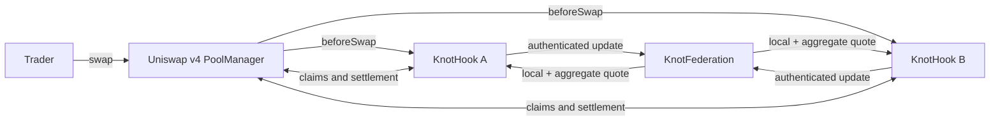

<p align="center">
  
</p>

<p align="center">
  <b><a href="https://knot-inky.vercel.app">App</a></b> ·
  <b><a href="https://knot-38d8bd0e.mintlify.app">Documentation</a></b> ·
  <a href="https://knot-38d8bd0e.mintlify.app/reference/architecture">Architecture</a> ·
  <a href="https://knot-38d8bd0e.mintlify.app/security/testing">Verification</a> ·
  <a href="SECURITY.md">Security boundaries</a>
</p>

> When the same token pair is split across several pools, one shallow or skewed pool can quote
> far beyond the price implied by the participating liquidity as a whole. KNOT gives those pools
> one shared, deterministic price boundary without pooling their custody or LP ownership.

[](https://docs.uniswap.org/contracts/v4/overview)
[](https://getfoundry.sh/)
[](https://soliditylang.org/)
[](#verification)
[](#verification)
[](LICENSE)

**UHI10 Hookathon · Sustainable Liquidity & MEV Protection**

> KNOT is unaudited hackathon software. Its experiments measure a bounded quote rule in constructed
> scenarios; they do not prove universal MEV protection or realised LP profit.

## The idea in one minute

Every participating pool keeps its own reserves, LP shares and fees. A shared federation stores
an authenticated reserve book for the same token pair and maintains the sum of all member reserves
in constant time.

Before each swap, KNOT computes two constant-product quotes:

1. the quote from that pool's local reserves;
2. the quote from the federation's aggregate reserves.

The trader receives the less favourable result:

\[
\text{exact input output}=\min(\text{local output},\text{aggregate output})
\]

\[
\text{exact output input}=\max(\text{local input},\text{aggregate input})
\]

If the local pool already offers the less favourable price, KNOT changes nothing. If the local
pool offers the better price, the difference is never paid out and remains in that pool's
reserves. No oracle, keeper, auction or off-chain classifier participates in the decision.

## A concrete example

The canonical test fixture has two member pools:

| Member | token0 | token1 | Purpose |
| --- | ---: | ---: | --- |
| Deep | 1,000 | 1,000 | Balanced control |
| Shallow | 100 | 400 | Deliberately skewed member |
| Aggregate | 1,100 | 1,400 | Virtual federation curve |

For a 5-token exact-input trade through the shallow member:

| Quote | Output |
| --- | ---: |
| Shallow pool alone | 18.993189 |
| Federation aggregate | 6.315922 |
| KNOT-enforced output | **6.315922** |

The bound reduces the isolated quote by **6,674 bps** in this fixture. In the balanced deep member,
the local quote is already more conservative and the bound is inert. The example proves the
selection rule, not that reserve divergence is inherently toxic.

## Why this belongs in a Uniswap v4 hook

A router-only rule can be bypassed by using another router. KNOT enforces the boundary inside
each participating pool:

| v4 primitive | KNOT use |
| --- | --- |
| Hook permissions | Intercept initialization, swaps and liquidity modification |
| Before-swap return delta | Replace the pool's normal quote with the bounded custom-accounting result |
| PoolManager unlock accounting | Settle input and output atomically |
| ERC-6909 claims | Back active reserves, pending deposits and refunds inside PoolManager custody |
| Dynamic fee flag | Keep the constant-product fee inside KNOT's quote instead of charging twice |

The hook returns no external oracle price. It executes a deterministic reserve policy against
the same call that updates both the local and aggregate books.

## Architecture



- [`KnotHook.sol`](packages/contracts/src/hooks/KnotHook.sol) owns one member's custom-accounting
  reserves, LP shares, pending liquidity and PoolManager claims.
- [`KnotFederation.sol`](packages/contracts/src/core/KnotFederation.sol) authenticates members,
  maintains per-member books and updates the O(1) aggregate.
- [`KnotMath.sol`](packages/contracts/src/libraries/KnotMath.sol) implements fee-aware exact-input
  and exact-output quotes with rounding against the taker.

The federation never custodies tokens. It is the shared accounting authority; each hook remains
the custody and LP boundary for its own pool.

## Liquidity lifecycle

New capital cannot enter the quote and immediately leave:

1. **Queue:** the hook takes the assets but excludes them from active reserves.
2. **Mature:** the request waits an immutable number of blocks.
3. **Activate:** shares mint at the current reserve ratio, not the earlier deposit ratio.
4. **Exit lock:** newly activated shares wait through a second maturity window before transfer
   or withdrawal.
5. **Cancel or claim:** only the provider can cancel a pending request or claim unused assets.

Pending capital never blocks swaps, active withdrawals, other deposits or removal of an empty
member. The custody identity is:

```text
PoolManager claims = active reserves + inactive provider assets + provider refunds
```

## Unichain Sepolia deployment

KNOT is live on **Unichain Sepolia (chain 1301)** against the canonical Uniswap v4
[PoolManager](https://sepolia.uniscan.xyz/address/0x00b036b58a818b1bc34d502d3fe730db729e62ac).
The release began at block `61583973`; its two members were activated after the configured
one-block maturity window and then exercised through the deployed Universal Router in all four
single-hop modes.

| Component | Address |
| --- | --- |
| KnotFederation | [`0x49579383965f68079FB671b1d7AF0071cf206199`](https://sepolia.uniscan.xyz/address/0x49579383965f68079FB671b1d7AF0071cf206199) |
| KnotHook · deep | [`0x55c73752E38403DDd30d03039568A5090256aa88`](https://sepolia.uniscan.xyz/address/0x55c73752E38403DDd30d03039568A5090256aa88) |
| KnotHook · shallow | [`0x1c828fA6d4232E80aaeCEb143736092b0F822A88`](https://sepolia.uniscan.xyz/address/0x1c828fA6d4232E80aaeCEb143736092b0F822A88) |
| kETH · currency0 | [`0x0784b9D734f2a6d13209087964640B1aD7699AAe`](https://sepolia.uniscan.xyz/address/0x0784b9D734f2a6d13209087964640B1aD7699AAe) |
| kUSD · currency1 | [`0x243B3f2672Bdd36b63cA960AE201ECDDA4a7b83e`](https://sepolia.uniscan.xyz/address/0x243B3f2672Bdd36b63cA960AE201ECDDA4a7b83e) |

| Pool | Pool ID |
| --- | --- |
| Deep | `0xa37acc9c7b38bddba8dd58392ef174e031308d7d674250d3ac96ca5b668b6ce4` |
| Shallow | `0xfd1361ff40dcbffa9fbf20ab5dc741b0378f74cfb55c0d9519322126fe8b6d71` |

The public proof transactions are linked in the canonical
[`unichain-sepolia.json`](deployments/unichain-sepolia.json) manifest. That manifest also records
the runtime code hash, post-proof reserve snapshot, quote outputs, PoolManager claim backing, and
each deployment, registration, initialization, activation, and router transaction hash. The web
app refuses to build an active release if any required proof field is missing or inconsistent.
The federation, both hooks, and both test tokens are exact creation- and runtime-bytecode matches
on Sourcify.

## Quick start

Prerequisites: Node.js 22+, npm 10+ and Foundry.

```bash
git clone https://github.com/Hijanhv/KNOT-hook-.git
cd KNOT-hook-
npm install
npm run check
npm test
npm run dev
```

Open `http://localhost:3000`. The quote inspector reads the live federation on Unichain Sepolia;
if the public RPC is unavailable, it switches to the deterministic fixture and labels that data
as a reference calculation.

Run focused contract suites from the workspace root:

```bash
npm run test:unit --workspace @knot/contracts
npm run test:integration --workspace @knot/contracts
npm run test:security --workspace @knot/contracts
npm run test:invariant --workspace @knot/contracts
npm run test:coverage
```

Run the full transaction lifecycle on a disposable Anvil chain:

```bash
cd packages/contracts
anvil --port 8550 --chain-id 31337 --block-time 1 --gas-limit 200000000 --silent &
knot_anvil_pid=$!
trap 'kill "$knot_anvil_pid"' EXIT

forge script script/local/LocalE2E.s.sol:LocalE2E \
  --rpc-url http://127.0.0.1:8550 \
  --unlocked \
  --sender 0xf39fd6e51aad88f6f4ce6ab8827279cfffb92266 \
  --broadcast \
  --slow
```

Success ends with `LOCAL_E2E_OK` after two members deploy and seed, all four swap branches execute,
pending liquidity activates and refunds, LP shares withdraw, and every reserve/custody identity is
checked again.

## Verification

`forge test` runs **182 passing cases across 19 suites**. The KNOT source reports **99.19% line,
96.44% statement, 82.61% branch and 100% function coverage**.

| Area | Evidence |
| --- | --- |
| Quote math | Independent integer oracle, both directions, both swap modes, rounding and boundary values |
| Hook integration | Canonical v4 PoolManager execution, settlement rollback, native ETH and custody identities |
| Federation safety | Authentication, code identity, membership churn, aggregate equality and atomic multi-member batches |
| Liquidity safety | Pending isolation, maturity boundaries, activation ratio, refund ownership and exit lock |
| Adversarial behavior | Sandwiches, backruns, slicing, cycles, donation, JIT liquidity, buddy pools and coalition influence |
| Stateful checks | Five high-depth invariant properties and 163,840 calls with zero handler reverts |
| Runtime | 13,801-byte hook, leaving 10,775 bytes below EIP-170 |
| Gas | 41,458-gas hook overhead against the matching hookless v4 fixture |

Detailed suite ownership is in the public [testing guide](apps/docs/security/testing.mdx); the
bounded economic results and methodology are summarized in [the results guide](apps/docs/security/results.mdx).

## Results that constrain the claim

The tests deliberately preserve results that are inconvenient but important:

- a balanced same-member sandwich remains profitable at about **0.393701 token0** with KNOT,
  compared with **1.803279 token0** in the hookless fixture;
- a coalition-controlled member can loosen the aggregate boundary by **4,722 bps** in the
  constructed capital-bounded scenario;
- pools outside the federation bypass the boundary;
- corrective flow can be clipped because KNOT selects quote direction, not trader intent;
- the aggregate curve is a virtual policy boundary, not a fair-price oracle or executable
  cross-pool route.

KNOT is therefore a deterministic reserve-aware boundary for participating pools—not universal
MEV prevention.

## Repository map

```text
KNOT-hook-/
├── apps/
│   ├── web/                       Next.js product and quote inspector
│   └── docs/                      Mintlify documentation
├── packages/
│   └── contracts/
│       ├── src/{core,hooks,libraries}/
│       ├── script/{deploy,local,verify}/
│       ├── test/{unit,integration,security,invariant,benchmark,fixtures}/
│       └── lib/                   Pinned contract dependencies
├── docs/
│   ├── protocol/                  Design and mechanism notes
│   ├── assurance/                 Verification guide
│   ├── research/                  Economic methodology and results
│   └── submission/                Demo and form preparation
├── assets/readme/                 Repository visuals
├── SECURITY.md                    Trust assumptions and unsupported assets
└── package.json                   Workspace command surface
```

## Security boundaries

Supported now:

- one owner-approved federation for one canonically sorted pair;
- exact-input and exact-output swaps in both directions;
- conventional ERC-20 pairs and native ETH;
- bounded membership and two-stage LP maturity;
- custom accounting against the canonical v4 PoolManager.

Explicitly unsupported:

- fee-on-transfer, rebasing or callback-bearing ERC-20s;
- permissionless federation membership;
- unregistered pools, cross-pair or cross-chain strategies;
- an external fair-price guarantee;
- coalition-proof or universal MEV protection;
- production use without an independent audit.

Read [SECURITY.md](SECURITY.md) before changing hook permissions, membership, reserve accounting,
settlement or LP lifecycle logic.

## License

[MIT](LICENSE)
