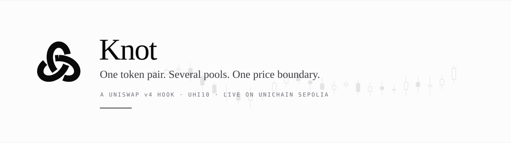
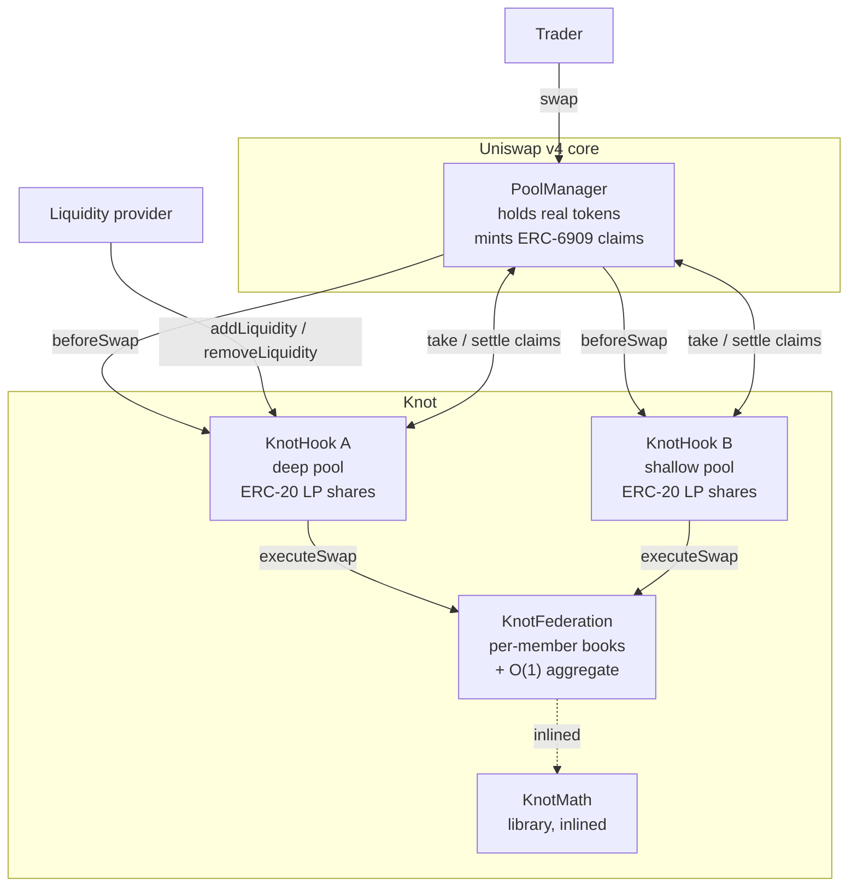
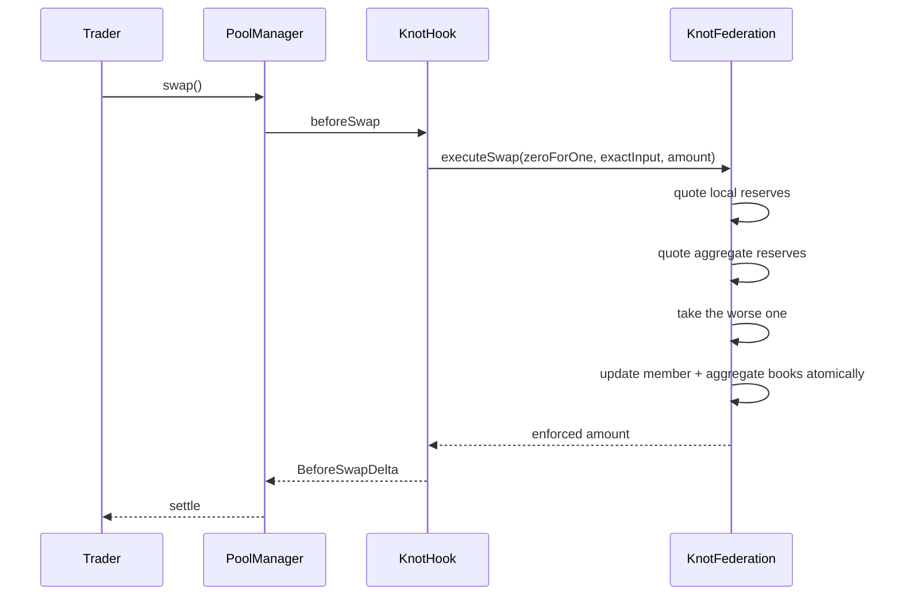
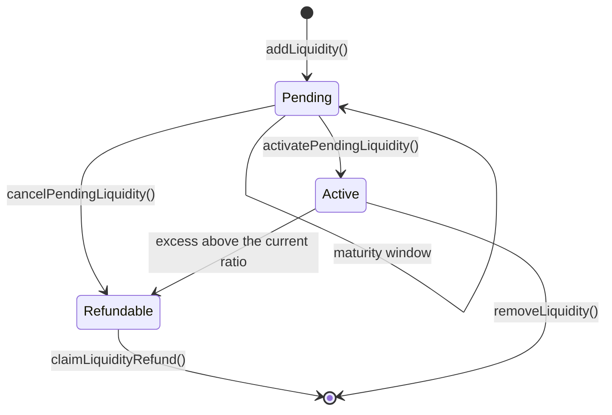

<p align="center">
  
</p>

<p align="center">
  <b><a href="https://hijanhv.github.io/KNOT-hook-/">Live app</a></b> ·
  <b><a href="https://knot-38d8bd0e.mintlify.app">Documentation</a></b> ·
  <a href="https://knot-38d8bd0e.mintlify.app/reference/architecture">Architecture</a> ·
  <a href="https://knot-38d8bd0e.mintlify.app/security/testing">Test suites</a> ·
  <a href="https://knot-38d8bd0e.mintlify.app/security/limits">Limits</a> ·
  <a href="deployments/unichain-sepolia-2026-08-23.md">Deployment record</a>
</p>

> A stale or shallow pool can hand a taker a better quote than the pair's combined liquidity
> actually supports. Knot makes participating pools check both reserve states before a trade,
> and leaves the difference with the LPs who would otherwise have funded it.

[](https://docs.uniswap.org/contracts/v4/overview)
[](https://getfoundry.sh/)
[](https://soliditylang.org/)
[](#verify)
[](#verify)
[](LICENSE)

**UHI10 Hookathon · Sustainable Liquidity & MEV Protection**

**Project ID: `HK-UHI10-1087`**

**Live on Unichain Sepolia.** Federation [`0x91A0…A129`](https://sepolia.uniscan.xyz/address/0x91A0489A1BEA8030AC82351D52BDC3F97d6cA129) ·
deep [`0x3469…6A88`](https://sepolia.uniscan.xyz/address/0x346930bcf767614a6C4654904739cBCF4A8f6A88) ·
shallow [`0x6B8D…AA88`](https://sepolia.uniscan.xyz/address/0x6B8D77a921Adc5244bC0398fa6133841F3DFaA88) ·
[deployment record](deployments/unichain-sepolia-2026-08-23.md)

> **Status:** unaudited hackathon software. The results below are constructed adversarial
> scenarios against the canonical v4 `PoolManager`. They measure mechanics, not realised LP P&L.

---

## The problem

A token pair rarely lives in one pool. The same two assets sit in several, at different fee
tiers or behind different hooks, and each one prices in isolation.

That makes the shallowest pool the weak link. It is the cheapest to move, the slowest to
correct, and while it is out of line it will quote a rate the pair's combined liquidity does not
support. A taker who routes into it is paid out of reserves that were never deep enough to
justify the price. The LPs of that one pool fund the difference.

## The solution

Knot connects participating pools through one shared reserve ledger, and quotes every swap
twice: once against the pool's own reserves, once against the federation's aggregate. The taker
receives the **less favourable** of the two.

```text
exact input:   output = min(local output, aggregate output)
exact output:  input  = max(local input,  aggregate input)
```

The clipped difference is never transferred anywhere. It simply is not paid out, so it stays in
the local pool's reserves and accrues to that pool's LP shares. There is no oracle, no keeper, no
auction and no off-chain component: the same state and the same arguments always produce the same
quote.

## The impact

| | |
|---|---|
| **For LPs in a skewed pool** | Up to **6,674 bps** of a taker's isolated quote stays in the pool instead of leaving with them |
| **For LPs in a balanced pool** | Nothing changes. The bound is inert when a pool is in line with its pair |
| **For takers** | A quote that the pair can actually support, at a cost of **41,262 gas** |
| **For the pair** | Flow that leaves the skewed member lands on another member. Measured **0 of 40** routes left the federation |

## Deployed contracts

Live on **Unichain Sepolia** (chain 1301), `PoolManager`
[`0x00b0…62ac`](https://sepolia.uniscan.xyz/address/0x00b036b58a818b1bc34d502d3fe730db729e62ac).

| Contract | Address | Role |
|---|---|---|
| `KnotFederation` | [`0x91A0489A1BEA8030AC82351D52BDC3F97d6cA129`](https://sepolia.uniscan.xyz/address/0x91A0489A1BEA8030AC82351D52BDC3F97d6cA129) | Authenticated per-member reserves plus the O(1) aggregate pair. Every quote is derived here |
| `KnotHook` (deep) | [`0x346930bcf767614a6C4654904739cBCF4A8f6A88`](https://sepolia.uniscan.xyz/address/0x346930bcf767614a6C4654904739cBCF4A8f6A88) | Balanced member, seeded 1000 / 1000. The bound is inert here, which is the control case |
| `KnotHook` (shallow) | [`0x6B8D77a921Adc5244bC0398fa6133841F3DFaA88`](https://sepolia.uniscan.xyz/address/0x6B8D77a921Adc5244bC0398fa6133841F3DFaA88) | Skewed member, seeded 100 / 400. The bound binds here, withholding 6,674 bps |
| `KnotMath` | no address | A library, inlined into both hooks at compile time |

Both hook addresses were mined with `HookMiner` so their low bits carry the required permission
flags. Federation owner: `0x35d8E75295366e6A12B988084096d89233dF4e9C`. Full record with the
seeded state and the on-chain verification:
[deployment record](deployments/unichain-sepolia-2026-08-23.md).

## Who this is for

- **Liquidity providers** on volatile pairs fragmented across several pools, who are currently
  paying for the weakest pool's mispricing.
- **Pool deployers and DAOs** launching a pair across more than one fee tier who want the tiers
  to price as one book rather than compete against each other.
- **Protocol teams** who want MEV resistance without adopting an oracle, an auction, a
  sequencer-level dependency or a trusted off-chain actor.

Knot is **not** for a single isolated pool. With one member the aggregate is the local book, the
bound never binds, and it behaves exactly like a plain constant-product pool.

## The mechanism at a glance

Two Uniswap pools can hold the same tokens and quote very different prices. The shallower one
becomes the weak link: easier to move, and an attacker can take the generous quote it offers
in isolation even though the pair's combined liquidity does not support it.

Knot connects participating pools through one shared reserve ledger. Every swap is quoted
twice, against the local pool and against the federation aggregate, and the trader receives
the **less favourable** of the two. The clipped difference stays with the local pool's LPs.

```text
exact input:   output = min(local output, aggregate output)
exact output:  input  = max(local input,  aggregate input)
```

Pools keep their own reserves, fees and LP ownership. They share only the calculation that
stops one of them becoming the easy exit.

## Key numbers

Measured in `test/MEVProtection.t.sol`, except the gas row (`test/GasBenchmark.t.sol`) and
the size row (`forge build --sizes`). Full write-up:
[`research/mev-findings.md`](research/mev-findings.md).

| | Value |
|---|---|
| Value withheld from a taker exploiting a skewed pool | **6,674 bps** of the isolated quote |
| Advantage from splitting a trade 8 ways | **none**, sliced output is marginally worse |
| Attacker P&L sandwiching through one pool | **−1.484** currency0 (a loss) |
| **Protection loosened by a coalition-controlled member pool** | **4,722 bps (≈47%)** |
| Federation overhead per swap, vs a hookless v4 pool | 41,262 gas (97,023 vs 55,761) |
| `KnotHook` runtime size | 12,936 bytes (24,576 limit) |

Every figure is reproducible from the suite. The full threat model, including where the
mechanism is only partially closed, is documented at
[knot docs / limits](https://knot-38d8bd0e.mintlify.app/security/limits).

## Architecture

Every participating pool is its own hook instance with its own LPs and its own reserves. The only
thing they share is the ledger they all quote against. `KnotFederation` never custodies a token:
it is an accounting authority, so a bug there cannot move funds, only mis-quote them.



One swap, start to finish:



Full diagrams, including the liquidity lifecycle state machine and trust boundaries, are in the
[architecture docs](https://knot-38d8bd0e.mintlify.app/reference/architecture).

## How it works

- **`KnotHook.sol`**: a hook-owned constant-product pool with proportional ERC-20 LP shares.
- **`KnotFederation.sol`**: authenticated per-member reserves plus the O(1) aggregate pair.
- **`KnotMath.sol`**: fee-aware exact-input and exact-output quoting, rounding against the taker
  in both directions.

Membership is bounded and permissioned: the federation owner registers reviewed hook instances,
and only registered hooks can move reserve state. New liquidity must mature before it enters the
shared book, so fresh capital cannot back a single quote and leave. Empty members can unregister
and release their slot.

### Liquidity lifecycle

Each provider has an **independent** pending request. There is no global lock, which means one
provider's pending deposit can never stall swaps, withdrawals, or anyone else's deposit.



Only the provider can activate, cancel or claim their own request. Shares mint at the reserve
ratio current **at activation**, not at deposit, so capital that arrives late cannot capture
gains that accrued before it entered. That is what closes just-in-time liquidity.

1. **Queue**: assets are taken and held inactive. No shares are minted.
2. **Activate**: after the maturity window, shares mint at the *current* reserve ratio, so
   pending capital cannot capture gains that accrued before it entered.
3. **Cancel / claim**: only the provider can activate, cancel or claim, and any excess is
   refundable to them alone.

Custody reduces to one equation: `PoolManager claims = active reserves + inactive provider assets`.

## Using it

Dependencies are vendored under `lib/`, so a fresh clone needs no install step.

### 1. Run the suite

```bash
git clone https://github.com/Hijanhv/KNOT-hook-.git && cd KNOT-hook-

forge test                                          # full suite, 138 tests
forge test --match-contract MEVProtectionTest  -vv  # the headline adversarial results
forge test --match-contract MEVAdversarialTest -vv  # federation-specific attacks
forge test --match-contract GasBenchmarkTest   -vv  # cost against a hookless v4 pool

# Coverage needs --ir-minimum. The unoptimised build that coverage forces
# otherwise hits "stack too deep" in script/Deploy.s.sol.
forge coverage --ir-minimum --no-match-coverage "^(test|script)/"
```

### 2. Read a live quote

`preview` is a view, so this is the same call a swap executes against. No wallet needed.

```bash
cast call 0x91A0489A1BEA8030AC82351D52BDC3F97d6cA129 \
  "preview(address,bool,bool,uint256)(uint256,uint256,uint256)" \
  0x6B8D77a921Adc5244bC0398fa6133841F3DFaA88 true true 5000000000000000000 \
  --rpc-url https://sepolia.unichain.org

# localQuote      18993189503262370814   what the shallow pool would pay alone
# aggregateQuote   6315922840581546355   what the pair supports
# knotQuote        6315922840581546355   what the taker actually gets
```

### 3. Deploy your own federation

Two phases, because new liquidity has to mature before it enters the shared book.

```bash
cp .env.example .env                  # set POOL_MANAGER and RPC_URL
cast wallet import knot --interactive # the key never touches the filesystem

forge script script/DeployDemo.s.sol:DeployDemo \
  --rpc-url $RPC_URL --account knot --broadcast

# wait LIQUIDITY_MATURITY_BLOCKS, then set DEEP_POOL / SHALLOW_POOL from the output
forge script script/DeployDemo.s.sol:Activate \
  --rpc-url $RPC_URL --account knot --broadcast
```

Full walkthrough in [`DEPLOY.md`](DEPLOY.md).

### 4. Run the frontend

The app is deployed at **[hijanhv.github.io/KNOT-hook-](https://hijanhv.github.io/KNOT-hook-/)**
and reads the live Unichain Sepolia contracts. To run it locally:

```bash
cd frontend && npm install && npm run dev   # http://localhost:3000
```

Addresses default to the live Unichain Sepolia deployment, so it reads the real chain with no
`.env.local`. Override with `NEXT_PUBLIC_FEDERATION`, `NEXT_PUBLIC_DEEP_POOL`,
`NEXT_PUBLIC_SHALLOW_POOL` to point it at your own.

### 5. Integrate

Any integrator reads `preview(hook, zeroForOne, exactInput, amount)` for a quote and swaps
through the normal v4 router. Nothing Knot-specific is required on the caller's side. See
[integrate](https://knot-38d8bd0e.mintlify.app/reference/integrate).

## Test suites

138 tests across 14 suites, 96.21% line coverage on `src/`. Nothing is mocked except the ERC-20s;
everything runs against the canonical v4 `PoolManager`.

| Suite | Tests | What it proves |
|---|---|---|
| [`MEVProtection`](test/MEVProtection.t.sol) | 9 | Textbook evasions: slicing, sandwiching, same-block JIT, and the coalition result |
| [`MEVAdversarial`](test/MEVAdversarial.t.sol) | 14 | Federation-specific: donation, cross-member and exact-output sandwiches, back-running, multi-block JIT, two- and three-member cycles, ordering independence, griefing, first-depositor |
| [`KnotFederationAttack`](test/KnotFederationAttack.t.sol) | 4 | Buddy-pool manipulation of the shared reference |
| [`EconomicViability`](test/EconomicViability.t.sol) | 6 | The cross-pool round trip, swept across sizes |
| [`RouterRealism`](test/RouterRealism.t.sol) | 5 | Whether the bound costs the federation its flow, plus the skew curve |
| [`ClampDirection`](test/ClampDirection.t.sol) | 2 | The bound bites the realigning trade, which is the honest cost |
| [`FailurePaths`](test/FailurePaths.t.sol) | 30 | Every guard, proven to actually guard |
| [`SuccessPaths`](test/SuccessPaths.t.sol) | 12 | Every expected effect, asserted rather than assumed |
| [`KnotHook`](test/KnotHook.t.sol) | 27 | The hook's full surface, including the live swap matrix |
| [`FederationStateMachine`](test/FederationStateMachine.t.sol) | 5 | Four stateful invariants over 8,192 lifecycle calls |
| [`Fuzz`](test/Fuzz.t.sol) | 12 | Bound, rounding and monotonicity under random input |
| [`KnotMath`](test/KnotMath.t.sol) | 5 | Quoting against an independent integer oracle |
| [`KnotNativeEth`](test/KnotNativeEth.t.sol) | 5 | The same lifecycle with native ETH as `currency0` |
| [`GasBenchmark`](test/GasBenchmark.t.sol) | 2 | Cost against a hookless v4 pool, asserted under Uniswap's 50k budget |

Which MEV class each test answers, attack by attack, is tabulated in the
[test-suite docs](https://knot-38d8bd0e.mintlify.app/security/testing).

## Why this needs to be a hook

A router could compute the same bound, but a trader can simply route around a router. A v4 hook
enforces the rule **inside** each participating pool, and custom accounting lets it compute the
protected amount, update the shared reserve state, and keep the clipped value with the right LPs,
all within the swap.

## Security posture

Reviewed against Uniswap's own [`v4-security-foundations`](https://github.com/Uniswap/uniswap-ai)
guidance.

| Category | Knot |
|---|---|
| `beforeSwapReturnDelta` | **Enabled**. Required for a custom curve. Uniswap rates this flag CRITICAL, so it is the highest-scrutiny part of the design |
| Reentrancy | `nonReentrant` on federation state changes; no callbacks during a quote |
| Access control | Reserve mutation restricted to registered members; membership restricted to the owner |
| Rounding | Both quote directions round against the taker |
| Custody | Hook-owned. `PoolManager claims = active reserves + inactive provider assets` |
| Donation resistance | Reserves are booked in the federation, never read from `balanceOf`, so a direct transfer moves no quote |
| Ordering resistance | No block-level signal is read at all: not gas price, base fee, coinbase, block number or timestamp |

Audited against Uniswap's own checklist: callbacks inherit `onlyPoolManager`, there are no
unbounded loops, no hardcoded addresses in `src/`, and no upgrade, `delegatecall` or
`selfdestruct` path. Federation overhead is 41,262 gas, inside Uniswap's 50,000 `beforeSwap`
budget and asserted by [`GasBenchmark.t.sol`](test/GasBenchmark.t.sol).

**No partner integrations.** UHI10's sponsor is the Uniswap Foundation; this project integrates
no third-party partner protocols.

## Inspiration

**The constraint came first.** A hook cannot know the true price of an asset without importing an
oracle, and an oracle rules out the "any asset pair" half of the problem. So the question became:
what *can* a hook know that is both smaller and fully verifiable on-chain? The answer is the
reserves of other participating v4 pools for the same pair. Not a price anyone asserts, just
liquidity that is already there and already public.

**The name came from knot theory.** The mark is a trefoil, the simplest knot that cannot be
untied, and the first real object in the field. For a mechanism whose whole idea is tying several
pools into one price boundary, that was the honest symbol rather than a decorative one. It is
drawn from the parametric curve `x = sin t + 2 sin 2t`, `y = cos t - 2 cos 2t`, with its three
self-crossings solved numerically, so the three-fold symmetry falls out of the arithmetic instead
of being drawn by hand.

**The design was derived under six constraints**, written down before any code: no CEX feed,
keeper or off-chain classifier; no attempt to decide whether a trader is good or toxic; instant
atomic swaps in both directions; constant work per quote regardless of federation size; every
reserve used for pricing belongs to an authenticated member; and local `PoolManager` claims move
together with the aggregate ledger. The symmetric `min`/`max` rule is what those six leave you
with. The derivation is written up in [`docs/IDEATION.md`](docs/IDEATION.md).

**Built on** Uniswap [v4-core](https://github.com/Uniswap/v4-core) and
[v4-periphery](https://github.com/Uniswap/v4-periphery), with OpenZeppelin's
[`BaseCustomCurve`](https://github.com/OpenZeppelin/uniswap-hooks) providing the custom-accounting
base that makes a hook-owned curve possible at all.

## Documentation

The full docs are live at **[knot-38d8bd0e.mintlify.app](https://knot-38d8bd0e.mintlify.app)**,
with architecture diagrams, the mechanism worked through with numbers, the threat model and the
measured results.

| Page | Contents |
|---|---|
| [Introduction](https://knot-38d8bd0e.mintlify.app) | What it is and what it is for |
| [The rule](https://knot-38d8bd0e.mintlify.app/mechanism/the-rule) | Two quotes, and why the taker gets the worse one |
| [Execution flow](https://knot-38d8bd0e.mintlify.app/mechanism/execution-flow) | One swap, start to finish |
| [Architecture](https://knot-38d8bd0e.mintlify.app/reference/architecture) | Product architecture, lifecycle and trust boundaries |
| [Threat model](https://knot-38d8bd0e.mintlify.app/security/threat-model) | What is closed, what is open |
| [Results](https://knot-38d8bd0e.mintlify.app/security/results) | Every measured number |
| [Test suites](https://knot-38d8bd0e.mintlify.app/security/testing) | All 14 suites and the MEV class each answers |
| [Limits](https://knot-38d8bd0e.mintlify.app/security/limits) | The coalition result and what divergence does not prove |

In-repo long-form notes:

| File | Contents |
|---|---|
| [`docs/MECHANISM.md`](docs/MECHANISM.md) | The rule, worked through with numbers |
| [`docs/ARCHITECTURE.md`](docs/ARCHITECTURE.md) | Contracts and how they connect |
| [`docs/TESTING.md`](docs/TESTING.md) | Test layout and what each layer proves |
| [`docs/DEMO.md`](docs/DEMO.md) | Attacker-sequence walkthrough |
| [`research/mev-findings.md`](research/mev-findings.md) | Adversarial results in full, including the coalition number |
| [`SECURITY.md`](SECURITY.md) | Enforced properties and known limits |

## License

[MIT](LICENSE). Copyright (c) 2026 Knot contributors.

Third-party code is vendored under `lib/` and keeps its own licensing: Uniswap
[v4-core](https://github.com/Uniswap/v4-core) and
[v4-periphery](https://github.com/Uniswap/v4-periphery), OpenZeppelin
[uniswap-hooks](https://github.com/OpenZeppelin/uniswap-hooks) and
[contracts](https://github.com/OpenZeppelin/openzeppelin-contracts).

> **Status:** unaudited hackathon software. Not for production use without an audit.
