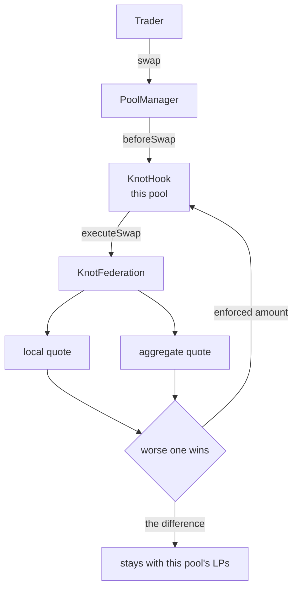

<Info>UHI10 Hookathon project ID: `HK-UHI10-1087`</Info>

Two Uniswap pools can hold the same tokens and quote very different prices. KNOT lets a group of
new pools opt into one rule: no member may give a taker a better quote than both its own curve and
a second curve computed from the members' combined reserves.

Knot connects participating pools through one shared reserve ledger. Every swap is quoted twice
and the trader receives the **less favourable** of the two. The clipped difference stays with the
local pool's LPs.



<CodeGroup>
```text Exact input
output = min(local output, aggregate output)
```
```text Exact output
input = max(local input, aggregate input)
```
</CodeGroup>

This is arithmetic, not a prediction. There is no oracle or attacker classifier. The aggregate
curve is an internal policy boundary; it is not an external fair price.

<CardGroup cols={2}>
  <Card title="Before KNOT" icon="clock-rotate-left" href="/mechanism/before-knot">
    See why independent pools for one pair can expose incompatible quotes.
  </Card>
  <Card title="Architecture" icon="diagram-project" href="/reference/architecture">
    See which contract owns custody, accounting, and quote logic.
  </Card>
</CardGroup>

## What it is for

<CardGroup cols={2}>
  <Card title="Enforces" icon="shield">
    A deterministic upper bound on what a member pays out, or lower bound on what it charges.
  </Card>
  <Card title="Does not claim" icon="circle-minus">
    Fair-price discovery, toxicity detection, universal MEV protection, or realised LP profit.
  </Card>
</CardGroup>

## Measured results

| Metric | Value |
| --- | --- |
| Constructed cross-pool round trip | **+13.5843** without the rule; **-0.0298** with it |
| Quote reduction in the documented 4× fixture | **6,674 bps** of the isolated quote |
| Effect on a balanced pool | **0 bps**, the bound is inert |
| Advantage from splitting a trade 8 ways | none |
| Coalition-controlled member in the documented fixture | weakens the bound by **4,722 bps** |

<Note>
Unaudited hackathon software. These constructed figures measure contract mechanics against the
canonical v4 `PoolManager`; they do not measure realised LP P&L or production routing.
</Note>
