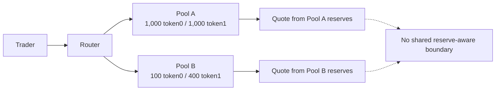
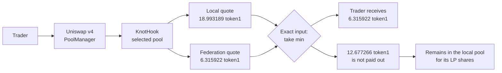

Without KNOT, each Uniswap pool prices a swap from its own reserves. Two pools can hold the same
token pair while remaining completely independent: they do not share liquidity, reserve state,
or a price boundary.

## The independent-pool path

For a five-token exact-input swap through Pool B, its isolated curve returns **18.993189 token1**.
Pool A does not participate in that calculation, even though both pools trade the same pair.

<Warning>
Reserve divergence is not proof of manipulation. It can result from legitimate flow, shallow
liquidity, or a newly created pool. KNOT does not classify why a pool is skewed.
</Warning>

## What changes with KNOT

Participating pools keep separate custody and liquidity-provider (LP) ownership. The hook adds one
shared accounting boundary: every swap is quoted once against the local reserves and once against
the sum of all member reserves.

The aggregate curve is virtual. A swap still settles against one pool, and the federation never
custodies tokens or creates a cross-pool route.

## Before and after

| Property | Before KNOT | With KNOT |
| --- | --- | --- |
| Quote source | Selected pool only | Local pool and federation aggregate |
| Exact-input result | Local output | `min(local output, aggregate output)` |
| Exact-output result | Local input | `max(local input, aggregate input)` |
| Pool custody | Independent | Independent |
| LP ownership and fees | Independent | Independent |
| Shared price boundary | None | Deterministic reserve-aware bound |
| Oracle or classifier | None | None |

KNOT changes the enforceable quote, not the ownership model. If the local pool already gives the
taker the less favourable result, the hook is inert.

<CardGroup cols={2}>
  <Card title="See the rule" icon="scale-balanced" href="/mechanism/the-rule">
    Follow the exact-input and exact-output decision branches.
  </Card>
  <Card title="Follow a swap" icon="arrow-right-arrow-left" href="/mechanism/execution-flow">
    Trace one transaction from the trader through settlement.
  </Card>
</CardGroup>
