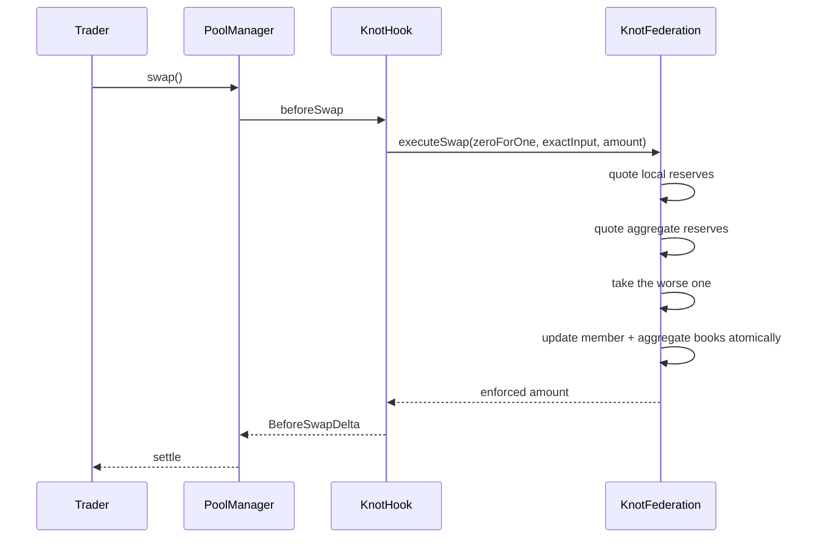

## Where the value goes

The clipped difference is never transferred anywhere. It simply is not paid out, so it remains in
the local pool's reserves and accrues to that pool's LP shares.

## Custody

One equation, asserted by five stateful invariants across 40,960 default calls and a 163,840-call
high-depth campaign:

```text
PoolManager claims = active reserves + inactive provider assets
```
