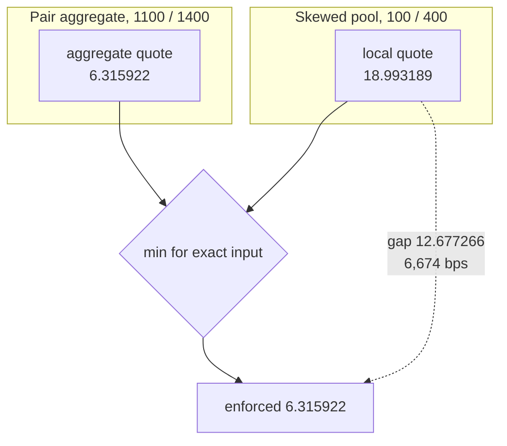

## Why two quotes

A pool's own reserves produce one constant-product quote. The federation's aggregate reserves
produce another. KNOT treats the less favourable quote as a deterministic policy boundary; the
aggregate is not an oracle or an external fair-price claim.

Those are `preview()` outputs from the documented deployment state for a five-token trade.

<Steps>
  <Step title="Local pool quotes">
    Constant product against this pool's own reserves.
  </Step>
  <Step title="Federation quotes">
    The same maths against the sum of every member's reserves.
  </Step>
  <Step title="Take the worse one">
    `min` for exact input, `max` for exact output.
  </Step>
  <Step title="The difference stays">
    The taker never receives the surplus. It remains in the local pool.
  </Step>
</Steps>

## Worked example

The shallow member holds 100 token0 and 400 token1. The deep member holds 1,000 and 1,000, so the
aggregate is 1,100 / 1,400. Alone, the shallow member offers far more token1 for a new token0 trade.

For five token0 in, the local curve pays 18.993189 token1 and the virtual aggregate curve quotes
6.315922. The trader receives **6.315922**. The remaining 12.677266 stays in the shallow member,
and both reserve books update atomically. The aggregate quote is a policy reference, not a claim
that one route can execute against pooled custody from every member.

## What binds, and when

The bound only bites when the local quote is better for the taker than the aggregate quote. Across
1,000 fuzz cases plus one concrete regression case, the implementation selected exactly that
direction. It does not inspect divergence magnitude or trader intent.

| Skew | Value withheld |
| --- | --- |
| 1× (balanced) | 0 bps |
| 2× | 4,299 bps |
| 4× | 6,674 bps |
| 8× | 7,862 bps |

A proportional member is untouched. The other rows are one controlled skew sweep; they are not a
claim about realised flow or LP returns.
