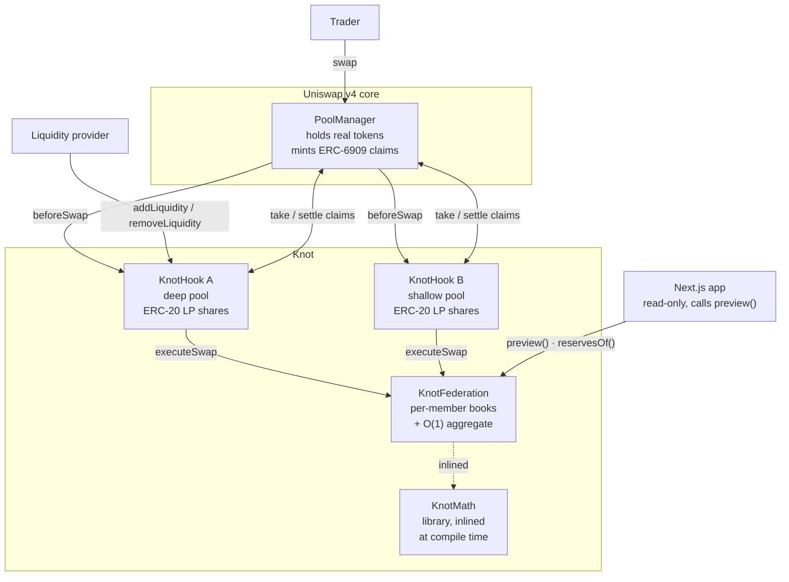
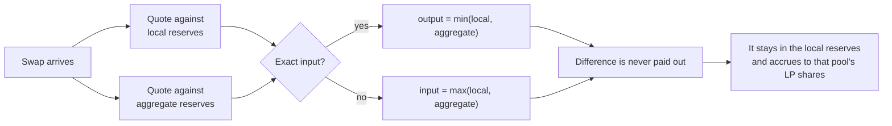
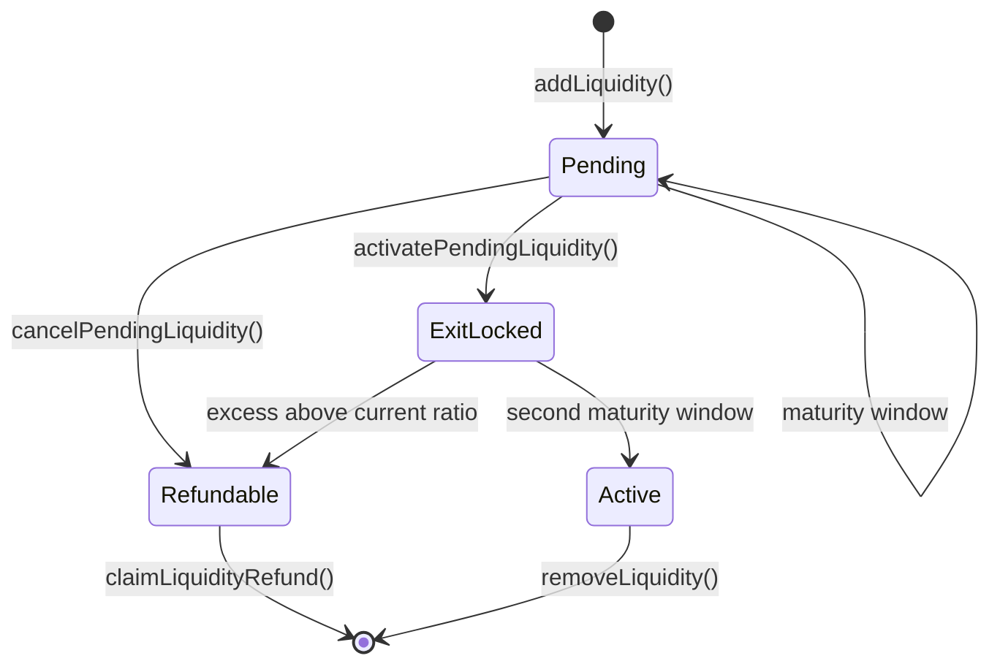
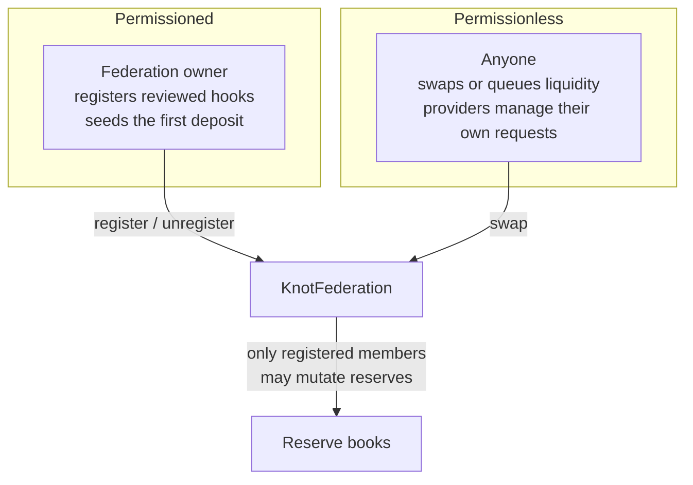

## Product architecture

Three contracts and a read-only frontend. Every participating pool is its own hook instance with
its own LPs and its own reserves. The only thing they share is the ledger they all quote against.



<Note>
`KnotMath` is a library, inlined into both hooks at compile time. It has no deployed address of
its own.
</Note>

## Who owns what

| Layer | Owns | Does not own |
| --- | --- | --- |
| `PoolManager` | The real ERC-20 balances | Any Knot accounting |
| `KnotHook` | Its pool's LP shares, its pending deposits, its ERC-6909 claims | The aggregate |
| `KnotFederation` | Every member's reserve book and the aggregate pair | Any tokens at all |
| `KnotMath` | Nothing. Pure functions | Everything |

The federation never custodies a token. It is an accounting authority, so a bug there cannot move
funds directly, only mis-quote them.

## The rule, as a decision



Both branches round against the taker, so rounding can never manufacture the surplus back.

## Liquidity lifecycle

Each provider's request is independent. There is no global lock, so a pending deposit cannot stall
swaps, withdrawals, or another provider.



Only the provider can activate, cancel or claim their own request. Shares mint at the reserve
ratio current **at activation**, not at deposit, so capital that arrives late cannot capture gains
that accrued before it entered. Newly minted shares then remain non-transferable and
non-withdrawable for a second maturity window. The two windows stop fresh capital from influencing
one quote and exiting immediately afterwards.

## Custody

Custody reduces to one equation, asserted by five stateful invariants over 40,960 default calls and
a 163,840-call high-depth campaign:

```text
PoolManager claims held by a hook
    = that pool's active reserves
    + its inactive provider assets
    + its unclaimed provider refunds
```

## Trust boundaries



Membership is the load-bearing control. A coalition that controls a member pool can skew the
aggregate and loosen the bound by roughly half, which is measured and stated in
[Limits](/security/limits). Permissioned membership is therefore security, not administration.
