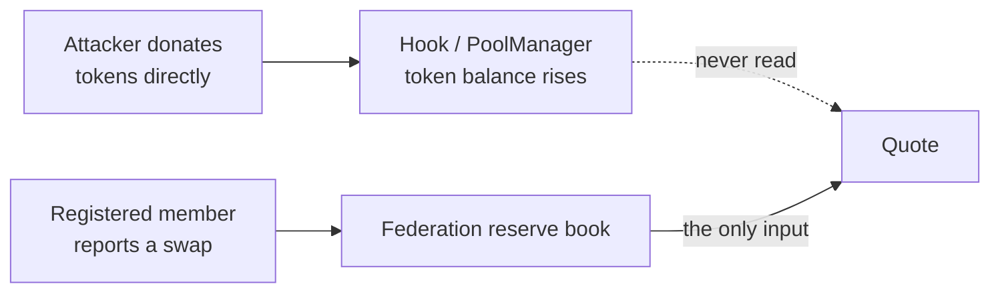

Foundry reports 204 passing cases: 190 KNOT-authored checks plus 14 inherited OpenZeppelin harness
methods. Live integration paths use the canonical v4 `PoolManager`; hostile token contracts are
isolated negative fixtures. Source-only coverage is **99.32% lines**, **96.95% statements**,
**84.62% branches**, and **100% functions**.

```bash
forge test                                        # all 204
forge test --match-contract MEVProtectionTest -vv # the headline adversarial results
forge test --match-contract MEVAdversarialTest -vv
forge coverage --ir-minimum --no-match-coverage "^(test|script)/" --report summary
```

## The suites

| Suite | Tests | What it exists to prove |
| --- | --- | --- |
| `GasBenchmark` | 2 | Cost against a hookless v4 pool, below the project's 50k overhead ceiling |
| `MultiPoolAtomicity` | 3 | Two- and three-member batches settle or roll back atomically |
| `FailurePaths` | 40 | Every guard, including registration identity and hook permission checks |
| `ClampDirection` | 2 | The bound can charge realigning flow; no intent claim is made |
| `RouterRealism` | 5 | Identical outside venues tie; no fabricated routing win |
| `MEVAdversarial` | 14 | Donation, cross-member/exact-output sandwiches, backruns, JIT, cycles, ordering and griefing |
| `SuccessPaths` | 12 | Every intended state transition, asserted rather than assumed |
| `TokenBoundaries` | 4 | Fee-on-transfer and rebasing exclusions, including negative rebase insolvency |
| `CallbackSafety` | 4 | Callback-token reentrancy fails without corrupting state |
| `KnotMath` | 5 | Quoting against an independent integer oracle |
| `MEVProtection` | 9 | The textbook evasions: slicing, sandwiching, same-block JIT, and the coalition result |
| `KnotNativeEth` | 5 | The full lifecycle with native ETH as `currency0` |
| `DirectionalSelectivity` | 4 | Exact quote direction that engages the rule; no toxicity or intent claim |
| `EconomicViability` | 6 | The cross-pool round trip, swept across sizes |
| `KnotHook` | 40 | Live swaps, custody, two-stage LP maturity, membership release and rollback |
| `MembershipStateMachine` | 2 | Registration churn preserves count, code identity and aggregate invariants |
| `KnotStateMachine` | 5 | Five stateful properties over mixed swap and liquidity lifecycles |
| `KnotFederationAttack` | 9 | Buddy-pool influence, membership, and three-member portfolio counterfactuals |
| `KnotFaucet` | 21 | Fixed drip per address behind a cooldown; never mints; drains loudly |
| `Fuzz` | 12 | Bound, rounding and monotonicity under randomized input |

The suite contains 29 fuzz properties. A high-depth run passed 10,000 runs per property.

Two three-member fuzz properties compare exact-input and exact-output front/victim/back portfolios
with the identical plain-pool route. Profitable KNOT routes do exist in arbitrarily skewed pools;
the checked property is only that KNOT did not amplify positive extraction in the sampled cases.
Each portfolio starts from its own copy of the sampled state: sharing one memory state across
both runs once compared the plain route against reserves the KNOT legs had already moved.
This is randomized evidence, not a universal theorem.
Five stateful invariants passed 163,840 calls with zero handler reverts.

## How each MEV class is answered

This is the part that matters for the theme, so it is stated attack by attack rather than as a
claim about the mechanism in general.

| Attack | How Knot answers it | Test |
| --- | --- | --- |
| **Cross-pool round trip** | Both legs use the local/aggregate boundary; the constructed shallow-pool exit loses its isolated quote advantage | `test_thesis_crossPoolRoundTripIsLessProfitableUnderKnot` |
| **Trade slicing** | In the tested exact-input property, applying the boundary as reserves move makes the sliced total no better than one equal-size trade | `test_evasion_splittingDoesNotBeatOneLargeTrade` / `testFuzz_splittingNeverBeatsOneTrade` |
| **Sandwich, skewed member** | A fully closed attacker inventory is unprofitable in this fixture; balanced-member tests separately show residual profit can remain | `test_evasion_skewedMemberSandwichIsUnprofitableInThisFixture` |
| **Sandwich, across members** | Moving the aggregate through one member reprices the attacker's own unwind | `test_sandwich_acrossTwoMembersStillLosesMoney` |
| **Back-running** | The follow-on trade is bounded by the same reference the victim moved | `test_backrun_aloneDoesNotExtractValue` |
| **Just-in-time liquidity, same block** | New deposits are inactive until maturity, so they cannot back a quote | `test_jit_freshLiquidityCannotBackTheSameBlockQuote` |
| **Just-in-time liquidity, multi-block** | Activation prices shares at the current ratio, then a second lock prevents immediate transfer or exit | `test_maturedJitCannotActivateBeforeVictimAndExitInSameBlock` |
| **Reserve donation** | Reserves are booked in the federation, never read from `balanceOf`, so a donation is inert | `test_donation_directTransferCannotMoveAnyQuote` |
| **Federation cycling** | Every lap of a two-member loop is asserted to lose, not just the average | `test_cycle_repeatedTwoPoolLoopBleedsTheAttackerEveryLap` |
| **Ordering and priority games** | Quote selection reads reserves and swap arguments, not timestamp, base fee, coinbase or block number; block number is used separately for LP maturity | `test_ordering_quoteIsIndependentOfEveryBlockLevelSignal` |
| **Flash-loan scale** | The quote either stays inside reserves or the trade is refused | `testFuzz_flashScaleTradeNeverOutrunsTheReserves` |
| **Sandwich, exact-output legs** | The other branch of the bound (max, not min) is a separate path and is asserted separately | `test_sandwich_builtFromExactOutputLegsAlsoLoses` |
| **Griefing / denial of service** | In the documented hostile-flow fixture, follow-on swaps remain live in both directions | `test_grief_hostileFlowCannotBlockHonestSwaps` |
| **Three or more live members** | A live three-member cycle covers aggregate transitions that the two-member fixture cannot exercise | `test_cycle_threeLiveMembersStillBleedTheAttacker` |
| **First-depositor share inflation** | The first deposit into an empty member is restricted to the federation owner | `test_firstDepositor_cannotSeedAnEmptyMember` |
| **Pending-seed bypass after full withdrawal** | A non-owner request queued earlier cannot become first active liquidity after supply reaches zero | `test_pendingProviderCannotBecomeFirstDepositorAfterFullWithdrawal` |
| **Locked-share laundering** | A provider cannot transfer newly activated shares around the exit lock | `test_lockedLiquiditySharesCannotBeTransferredToBypassWithdrawalDelay` |
| **Non-standard token semantics** | Fee, callback and rebase fixtures fail atomically or prove the external insolvency boundary; they are unsupported | `TokenBoundariesTest` / `CallbackTokenBoundaryTest` |
| **Coalition of members** | **Partially open.** Loosens the bound by 4,722 bps. See [Limits](/security/limits) | `test_coalition_attackerOwnedMemberPoolMovesTheAggregate` |

<Warning>
The coalition row is the weakest result in the project and it is deliberately in this table
rather than omitted. Permissioned membership is load-bearing security, not administration.
</Warning>

## Why donation immunity is structural

A donation can move a quote only when that quote source observes unsolicited token balances.
Knot does not. Its reserves live in `KnotFederation` and move only when a registered member reports
a completed swap or liquidity change.



That is an immunity rather than a cost, which matters: a cost falls when capital is cheap, and a
flash loan makes capital free.

## Determinism

Knot reads no oracle, keeper or off-chain input when selecting a quote. The quote is a function of
two reserve books and the swap arguments, so the same state and arguments produce the same output.
Block number is used elsewhere for LP maturity. `test_ordering_quoteIsIndependentOfEveryBlockLevelSignal`
pins down the narrower quote property by moving gas price, base fee, coinbase, block number,
timestamp and prevrandao at once and asserting the quote does not budge.
