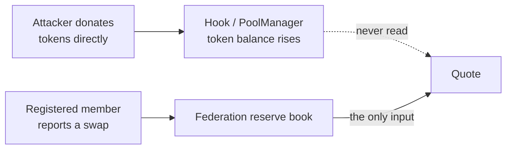

Every suite below runs on `forge test` against the canonical v4 `PoolManager`. Nothing is mocked
except the ERC-20s. Coverage on `src/` is **96.68% lines, 94.01% statements, 96.43% functions
and 74.07% branches**. The branch figure is the honest one to watch: the uncovered branches are
mostly revert arms already asserted by name in `FailurePaths`, which `forge coverage` does not
credit, but it is quoted rather than hidden behind the line number.

```bash
forge test                                        # all 150
forge test --match-contract MEVProtectionTest -vv # the headline adversarial results
forge test --match-contract MEVAdversarialTest -vv
forge coverage --ir-minimum --no-match-coverage "^(test|script)/"
```

## The suites

| Suite | Tests | What it exists to prove |
| --- | --- | --- |
| `MEVProtection` | 9 | The textbook evasions: slicing, sandwiching, same-block JIT, and the coalition result |
| `DefensiveGuards` | 8 | Every declared guard fired by selector, and why ReentrantCall has no reachable path |
| `DirectionalSelectivity` | 4 | The bound engages on direction and never on magnitude, on both branches |
| `MEVAdversarial` | 14 | Federation-specific attacks: donation, cross-member and exact-output sandwiches, back-running, multi-block JIT, two- and three-member cycles, ordering independence, griefing, first-depositor |
| `KnotFederationAttack` | 4 | Buddy-pool manipulation of the shared reference |
| `EconomicViability` | 6 | The cross-pool round trip, swept across sizes |
| `RouterRealism` | 5 | Does the bound cost the federation its flow, and the skew sensitivity curve |
| `ClampDirection` | 2 | The bound bites the realigning trade, which is the honest cost |
| `FailurePaths` | 30 | Every guard, proven to actually guard |
| `SuccessPaths` | 12 | Every expected effect, asserted rather than assumed |
| `KnotHook` | 27 | The hook's full surface, including the live swap matrix |
| `KnotFederationStateMachine` | 5 | Four stateful invariants over 8,192 lifecycle calls |
| `Fuzz` | 12 | Bound, rounding and monotonicity properties under random input |
| `KnotMath` | 5 | Quoting against an independent integer oracle |
| `KnotNativeEth` | 5 | The same lifecycle with native ETH as `currency0` |
| `GasBenchmark` | 2 | Cost against a hookless v4 pool, asserted under Uniswap's 50k budget |

## How each MEV class is answered

This is the part that matters for the theme, so it is stated attack by attack rather than as a
claim about the mechanism in general.

| Attack | How Knot answers it | Test |
| --- | --- | --- |
| **Cross-pool round trip** | Both legs are bounded by the aggregate, so the exit is priced as the pair, not as the shallow pool | `test_thesis_crossPoolRoundTripIsLessProfitableUnderKnot` |
| **Trade slicing** | The bound is applied per swap and reserves move per slice, so a sliced total is never better | `test_evasion_splittingDoesNotBeatOneLargeTrade` |
| **Sandwich, one pool** | Both attacker legs pay the bound; the clipped value stays in reserves | `test_evasion_sandwichDoesNotBreakTheBound` |
| **Sandwich, across members** | Moving the aggregate through one member reprices the attacker's own unwind | `test_sandwich_acrossTwoMembersStillLosesMoney` |
| **Back-running** | The follow-on trade is bounded by the same reference the victim moved | `test_backrun_aloneDoesNotExtractValue` |
| **Just-in-time liquidity, same block** | New deposits are inactive until maturity, so they cannot back a quote | `test_jit_freshLiquidityCannotBackTheSameBlockQuote` |
| **Just-in-time liquidity, multi-block** | Maturity delays it; fees plus the bound make the completed round trip lose | `test_jit_multiBlockDepositTradeWithdrawEndsDown` |
| **Reserve donation** | Reserves are booked in the federation, never read from `balanceOf`, so a donation is inert | `test_donation_directTransferCannotMoveAnyQuote` |
| **Federation cycling** | Every lap of a two-member loop is asserted to lose, not just the average | `test_cycle_repeatedTwoPoolLoopBleedsTheAttackerEveryLap` |
| **Ordering and priority games** | No block-level signal is read at all, so there is nothing to bid for | `test_ordering_quoteIsIndependentOfEveryBlockLevelSignal` |
| **Flash-loan scale** | The quote either stays inside reserves or the trade is refused | `testFuzz_flashScaleTradeNeverOutrunsTheReserves` |
| **Sandwich, exact-output legs** | The other branch of the bound (max, not min) is a separate path and is asserted separately | `test_sandwich_builtFromExactOutputLegsAlsoLoses` |
| **Griefing / denial of service** | Hostile flow cannot push a member into a state where honest swaps revert, in either direction | `test_grief_hostileFlowCannotBlockHonestSwaps` |
| **Three or more live members** | A larger aggregate is a weaker bound, so the cycle is run live across three members | `test_cycle_threeLiveMembersStillBleedTheAttacker` |
| **First-depositor share inflation** | The first deposit into an empty member is restricted to the federation owner | `test_firstDepositor_cannotSeedAnEmptyMember` |
| **Coalition of members** | **Partially open.** Loosens the bound by 4,722 bps. See [Limits](/security/limits) | `test_coalition_attackerOwnedMemberPoolMovesTheAggregate` |

<Warning>
The coalition row is the weakest result in the project and it is deliberately in this table
rather than omitted. Permissioned membership is load-bearing security, not administration.
</Warning>

## Why donation immunity is structural

Most constant-product pools derive reserves from `balanceOf`, which is why donating tokens to a
pool and then trading against the price you just moved has drained more than one fork. Knot never
reads a balance. Reserves live in `KnotFederation` and only move when a registered member reports
a completed swap or liquidity change.



That is an immunity rather than a cost, which matters: a cost falls when capital is cheap, and a
flash loan makes capital free.

## Determinism

Knot reads no oracle, no keeper, no off-chain input, and no block-level signal. A quote is a pure
function of two reserve books and the swap amount, so the same state and the same arguments always
produce the same output. `test_ordering_quoteIsIndependentOfEveryBlockLevelSignal` pins this down
by moving gas price, base fee, coinbase, block number, timestamp and prevrandao all at once and
asserting the quote does not budge.
