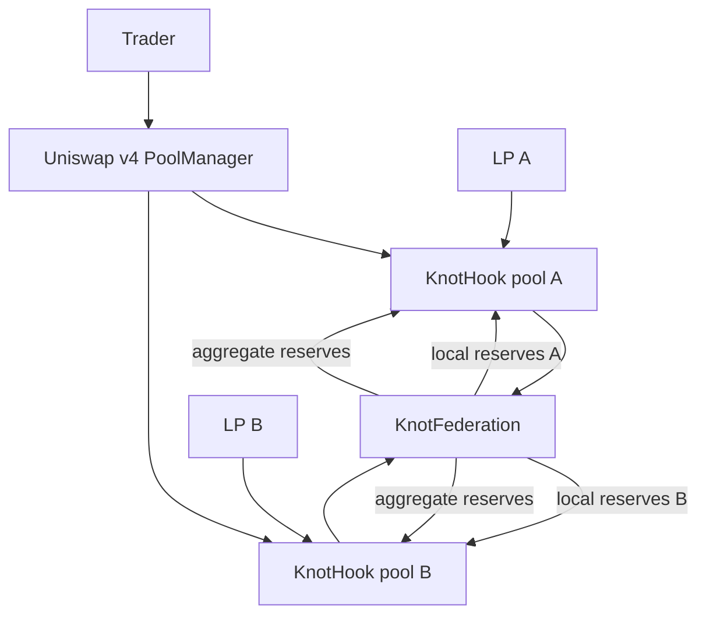
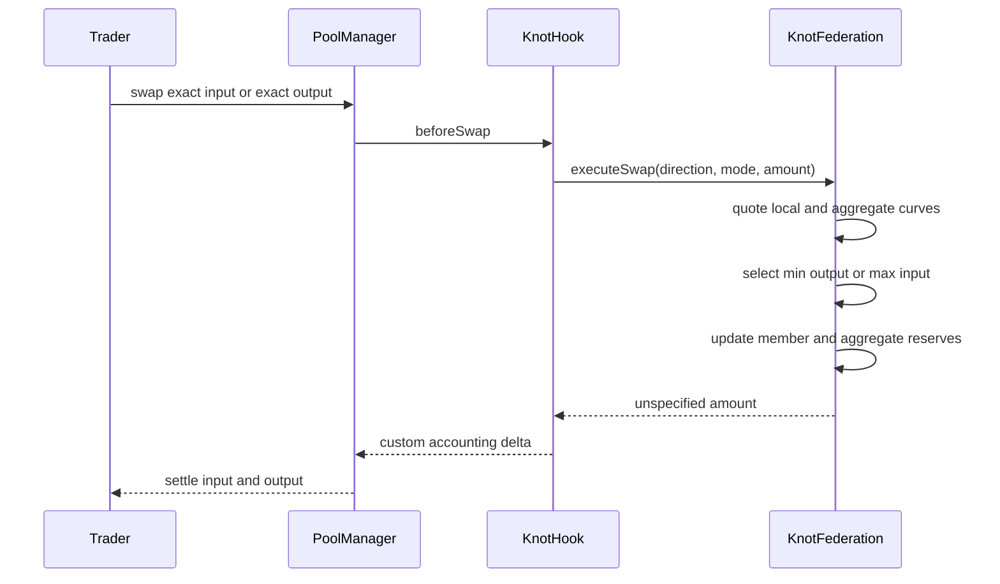

# Technical architecture

## System map



## Contracts

| Contract | Responsibility |
|---|---|
| `KnotHook` | One hook-owned v4 pool, custom curve and ERC-20 LP share ledger |
| `KnotFederation` | Member authentication, per-member reserves and the O(1) aggregate reserve pair |
| `KnotMath` | Fee-aware constant-product quotes with conservative integer rounding |

## Membership lifecycle

1. Deploy a `KnotFederation` for one ordered currency pair and fee.
2. Deploy a flag-valid `KnotHook` pointing to that federation.
3. The federation owner registers the hook.
4. Registration checks that the address contains code and reports this exact federation.
5. Only the federation owner can initialize the registered hook, and initialization checks the currencies again.
6. The owner seeds the first deposit. New liquidity enters a pending state before it can affect shared quotes.
7. A fully drained member can unregister and release its bounded slot. Pending deposits remain cancelable and refundable.

The owner cannot unregister a member with active reserves. Pending deposits never enter the federation book, so they cannot hold a slot or change the aggregate during removal.

## Swap flow



The federation performs no callback during the quote. If PoolManager settlement fails, the whole transaction reverts, including both reserve updates.

## Liquidity flow

The federation owner seeds the first deposit. Later deposits are permissionless. Each provider can hold one pending request per member, and requests never block swaps, withdrawals or other providers.

The hook transfers a proportional deposit into PoolManager custody but mints no shares while it matures. The provider may cancel at any time. After maturity, only that provider may activate. Activation recalculates shares from the current active reserve ratio, so pending capital receives no gains or losses from the waiting period. Any unused token amount becomes a provider-owned refund.

Withdrawals burn shares and return the same fraction of both reserves, rounded down. The federation and PoolManager claim balances update in the same transaction.

## State invariants

For each currency:

```text
aggregate reserve = sum(member reserves)
hook claims        = active member reserve + pending deposits + claimable refunds
```

For exact-input quotes:

```text
Knot output <= local output
Knot output <= aggregate output
```

For exact-output quotes:

```text
Knot input >= local input
Knot input >= aggregate input
```

## Complexity and trust

Swap computation and storage work are O(1). Federation size affects deployment and governance, not the quote loop.

The owner remains a trust boundary because it chooses members. Registered liquidity can also coordinate strategically. Those limits are explicit in `SECURITY.md` and are not hidden behind an oracle claim.
